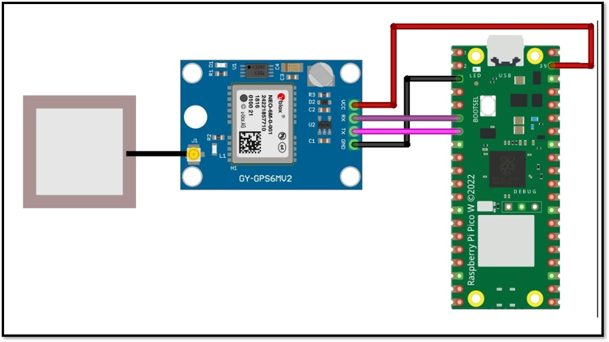
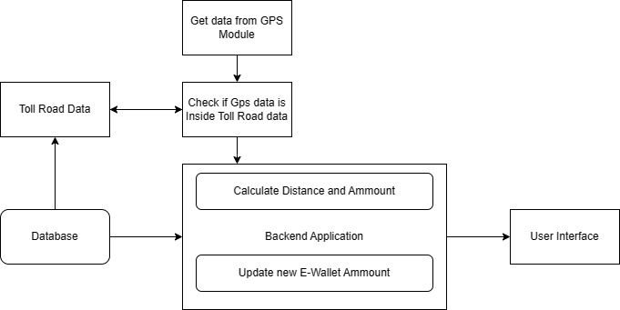

# Smart Toll Collection System Using GPS and Geofencing / Tollwise

## Introduction

The Smart Toll Collection System is designed to automate toll collection processes and optimize the user experience during highway travel. The system leverages GPS technology and geofencing algorithms to enable seamless toll payments without requiring vehicles to stop or slow down at toll booths. This project uses a Raspberry Pi Pico W and a NEO-6M GPS module to track vehicle movements in real-time. Tollwise, a React Native application, manages toll payments and transactions for vehicles, allowing users to log in, view their transaction history, check their wallet balance, and add funds to their account.

## Table of Contents

1. [Features](#features)
2. [Hardware Components](#hardware-components)
3. [Software Components](#software-components)
4. [Prerequisites](#prerequisites)
5. [Installation and Setup](#installation-and-setup)
6. [Usage](#usage)
7. [Architecture](#architecture)
8. [Methodology](#methodology)
9. [Future Work](#future-work)
10. [Contributing](#contributing)

## Features

- Automated toll calculation and payment
- Real-time vehicle tracking using GPS
- User authentication (Sign In, Sign Up)
- View transaction history and details on a map
- Check wallet balance and add funds to wallet
- User authentication and e-wallet management
- Seamless integration with a centralized server for transaction management
- User-friendly interface for viewing transaction history and account management

## Hardware Components

- Raspberry Pi Pico W
- NEO-6M GPS module
- Connecting wires

## Software Components

- Python for Raspberry Pi Pico W
- Node.js for server-side scripting
- MongoDB for database management
- Express.js for API handling
- JSON Web Tokens (JWT) for secure communication
- Axios for HTTP requests
- React Native for mobile application development
- Expo CLI for running the mobile application

## Prerequisites

- Node.js
- npm or yarn
- Expo CLI

## Installation and Setup

### Hardware Setup

1. Connect the NEO-6M GPS module to the Raspberry Pi Pico W as illustrated in the wiring diagram.
2. Ensure all connections are secure and the GPS module has a clear view of the sky for accurate positioning.



### Software Setup

1. **Server Setup:**

   - Install Node.js and MongoDB on your server.
   - Clone the repository and navigate to the project directory.
   - Install the required Node.js packages in both the server and app directory:
     ```
     npm install
     ```
   - Start the server:
     ```
     npm start
     # or
     nodemon app
     ```

2. **Raspberry Pi Pico W Setup:**

   - Write and upload the Python script to the Raspberry Pi Pico W to handle GPS data and communicate with the server.

3. **Mobile Application Setup:**
   - Install dependencies:
     ```
     npm install
     # or
     yarn install
     ```
   - Start the Expo server:
     ```
     npm expo start -c
     # or
     yarn expo start -c
     ```

### Environment Variables

Create a `.env` file in the project root and add the following environment variables:

- .env in server folder
  ```
  PORT = port number
  JWT_SECRET=your_jwt_secret
  MONGO_URI=your_mongodb_uri
  FAST_TWO_SMS_API_KEY = fastTwoSms_API_key
  FAST_TWO_SMS_URI = fastTwoSms_uri
  JWT_SECRET = JWT_secret_key
  STRIPE_SECRET_KEY = your_stripe_API_key
  ```
- .env in app folder
  ```
  BASE_URL=server_url
  STRIPE_PUBLISHER_KEY = your_stripe_API_key
  ```

## Usage

1. **On-Board Unit (OBU):**

   - Power on the vehicle's OBU.
   - The OBU will fetch data on nearby toll gates from the server.
   - As the vehicle approaches and passes through toll gates, the OBU will send entry and exit signals to the server.
   - The server calculates the toll amount based on the distance traveled and deducts it from the user's account.

2. **Mobile Application:**
   - Run the application on your device or emulator:
     ```
     npm run android
     # or
     npm run ios
     ```
   - Sign up or log in to access the main features of the application.
   - Users can manage their account, view transaction history, and top up their e-wallet through a mobile application or web interface.

## Architecture



## Methodology

The methodology involves the following steps:

1. **Hardware Setup:** Integrating the NEO-6M GPS module with the Raspberry Pi Pico W.
2. **Data Communication:** Using GPS satellites to track the vehicle's location and then communicate with the server.
3. **System Integration:** The server processes entry/exit signals, calculates toll amounts, manages transactions, and updates user accounts.

For a detailed explanation, refer to the Methodology section in the project documentation.

## Future Work

- Integration with additional payment gateways.
- Enhanced geofencing accuracy with more precise GPS data.
- Expansion of the system to cover more geographical locations and toll gates.
- Implementation of real-time traffic data analysis to optimize toll collection.
- Using modern technologies like artificial intelligence, machine learning, and data analytics to predict traffic patterns and optimize toll road operations.

For more information, please refer to the project documentation or contact the project developers.

## Contributing

Contributions are welcome! Please fork this repository and submit pull requests.

1. Fork the Project https://github.com/TejasPrabhu21/TollWise
2. Create your Feature Branch (`git checkout -b feature/AmazingFeature`)
3. Commit your Changes (`git commit -m 'Add some AmazingFeature'`)
4. Push to the Branch (`git push origin feature/AmazingFeature`)
5. Open a Pull Request
